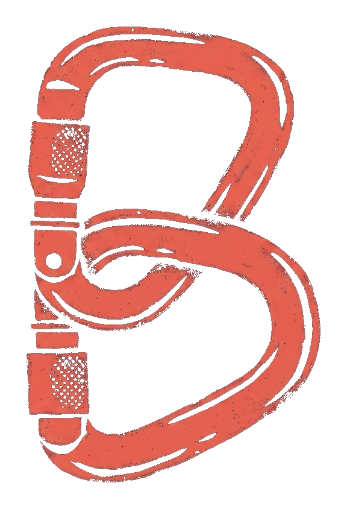

<div align="center">



# Belay

**The agent harness: sandbox any agent, verify each step by replaying it against real state, and keep a deterministic trace.**

Belay sits as a transparent proxy between an AI agent and the tools it calls. It **records** exactly what crossed, runs the tools **inside a sandbox**, snapshots each turn's real pre-state, and then **replays every tool call against that restored state** — rendering an honest `PASS` / `WARN` / `FAIL` / `UNVERIFIED` verdict grounded in *re-execution and a state diff*, never in a model's opinion of itself. Every caught failure becomes a labeled, replayable case in a corpus that compounds.

[](https://github.com/haqaliz/belay/releases/latest)
[](https://github.com/haqaliz/belay/actions/workflows/ci.yml)
[](docs/ROADMAP.md)
[](LICENSE)
[](https://www.python.org/)
[](https://github.com/astral-sh/uv)
[](pyproject.toml)
[](CONTRIBUTING.md)

[Quickstart](#quickstart) · [How it works](#how-it-works) · [The verdict](#the-verdict-three-axes-deliberately-unequal) · [Coverage & limits](#coverage--limits-stated-exactly) · [Roadmap](docs/ROADMAP.md) · [Vision](VISION.md) · [Contributing](CONTRIBUTING.md)

</div>

---

## Why Belay

Three kinds of tools sit near agents. Frameworks (LangGraph, CrewAI) *build* the agent. Observability (Langfuse, Phoenix, LangSmith, Braintrust) *records* what it did — and at most bolts an LLM-judge on top to score it. **Belay is the third thing: the harness.** It answers the question none of the others do — *"was this step actually correct?"* — by replaying the tool call in a sandbox and diffing observed-vs-claimed state.

Why that question matters, and why a judge can't answer it:

- **27–78% of benchmark-reported agent "successes" are *corrupt successes*** — the right end-state reached through a broken, unsafe, or cheating path ([arXiv 2603.03116](https://arxiv.org/abs/2603.03116)). A run can look done and be wrong.
- **LLM-as-judge is unreliable exactly where it matters:** up to **35% false positives** ([2507.08794](https://arxiv.org/abs/2507.08794)), with verdicts flipping 10–30% on trivial reorderings. A guess about correctness is not a verification of it.

Belay's verdict is **grounded in execution, not opinion** — which means it gets *better* as base models improve (they write better checks and cleaner tools), never redundant.

- 🧗 **The name.** To *belay*, in climbing, is to manage the rope that **catches a climber when they fall**. Belay catches an agent when it fails: it contains the fall, proves what happened, and lets you replay it. The harness holds; the climber takes the risk.
- 🧱 **Sandbox / execution boundaries.** The agent's tools run inside enforced filesystem and network limits — a bad action is contained, not catastrophic. The same boundary that *contains* an action is the machinery that *judges* it.
- 🔁 **Per-turn verification by replay.** Each tool call is re-executed in isolation against its restored pre-state, and the observed effect is diffed against what was claimed.
- 🎞 **Deterministic trace + replay.** Every run is captured exactly and can be re-run — for debugging, regression, and audit.
- 📈 **A compounding failure corpus.** Every caught failure becomes a labeled, replayable case; `belay corpus run` re-replays the whole corpus as a regression suite, and precision/recall/coverage measures detection against **human** labels.
- 🔒 **Runs on your infrastructure.** Self-hostable, zero runtime dependencies, stdlib only. Traces and state stay on your box; nothing is uploaded, ever.

> **Honesty is the whole product.** `UNVERIFIED` is *never* rendered as `PASS`, the verdict never over-claims beyond what the replay actually checked, and where Belay cannot see or cannot ground a claim it says so by name. Read [Coverage & limits](#coverage--limits-stated-exactly) before trusting any verdict.

---

## Quickstart

> **Requirements:** macOS (Apple Silicon or Intel), Python 3.10+. The sandbox and snapshot are macOS-only today — see [limits](#the-sandbox-is-macos-only). [uv](https://github.com/astral-sh/uv) is recommended.

Install (once v0.1.0 is published — until then, [run from source](#develop)):

```bash
uv tool install belay-harness      # or: pipx install belay-harness  /  pip install belay-harness
# the distribution is `belay-harness` (the name `belay` is taken on PyPI); the command is `belay`
belay --help
```

> **No container yet.** Belay's sandbox (macOS Seatbelt) and snapshot (APFS `clonefile`) are
> macOS-only, and a Linux container can't run them — so there is deliberately no Docker image
> until the Linux sandbox slice lands, rather than a container that can't do the core.

### 1 · Put the proxy in front of the server you already run

Belay is a transparent stdio proxy. Wherever your agent launches an MCP server, wrap the command:

```bash
# was:   my-mcp-server --flag
# now:
BELAY_TRACE_DIR=./traces \
BELAY_SANDBOX_SCOPE=./workspace \
  python -m belay.proxy my-mcp-server --flag
```

Bytes are forwarded verbatim in both directions. With `BELAY_SANDBOX_SCOPE` set, the server runs under macOS Seatbelt — a write outside the scope is refused by the kernel and recorded as a `denial` naming the path; **the network is denied by default** (`BELAY_SANDBOX_NETWORK=allow-all` to widen). Each `tools/call` is held just long enough to snapshot its pre-state before the call reaches the server.

### 2 · Verify the run by re-execution

```bash
belay verify ./traces/<run>.jsonl --manifest-dir ./traces.manifests --server my-mcp-server --flag
```

For each recorded `tools/call`, Belay restores its pre-state, re-invokes the server, and renders a per-turn verdict:

- **A2 — replay:** did the recorded result reproduce, and did the filesystem effect match the tool's declared `readOnlyHint`? (catches *trace infidelity*)
- **A1 — invariant:** was a task-scoped policy violated by the observed effect? The `tests/` read-only default is on unless `--no-default-invariants`; add your own with `--invariants policy.json`. (catches *corrupt success* — a cheating agent whose trace is perfectly faithful, which A2 structurally cannot catch)

Both are decided by **re-execution and diffing. No model is consulted** — enforced by an AST test that bans any inference import from the verdict path.

### 3 · Grow the corpus

```bash
belay corpus add ./traces/<run>.jsonl --turn 7 --manifest-dir ./traces.manifests --server my-mcp-server
belay corpus label <case-id> --label true-positive     # a human adjudicates; the engine never labels its own cases
belay corpus run                                        # re-replay every case, assert its verdict — the corpus IS the regression suite
belay corpus score                                      # precision · recall · coverage vs human labels (UNVERIFIED excluded, reported separately)
```

Cases are self-contained (they bundle their own pre-state) and live under the gitignored `corpus/local/` — nothing leaves your machine.

---

## How it works

```
agent  ⇄  [ belay.proxy ]  ⇄  MCP server
              │   records every frame verbatim  → append-only trace (.jsonl)
              │   runs the server in a sandbox   → writes outside scope refused, network denied by default
              │   snapshots each turn's pre-state → APFS clonefile + a fidelity-declaring manifest
              ▼
         belay verify / corpus
              restore pre-state → re-invoke → diff observed vs claimed → grounded verdict
```

The engine is built in capability layers (see [the roadmap](docs/technical/CAPABILITY_ROADMAP.md)): **C1** capture, **C2** sandbox + snapshot/restore, **C3** deterministic replay with a real before/after delta, **C4** the A2 replay verdict, **C5** the A1 invariant verdict, **C6** the failure corpus. All merged; zero runtime dependencies.

### The verdict: three axes, deliberately unequal

| Axis | Grounding | May emit | Catches | Status |
|------|-----------|----------|---------|--------|
| **A1 · Invariant** | A task-scoped policy, violated during replay | PASS / WARN / FAIL / UNVERIFIED | **Corrupt success** (the 27–78%) | ✅ built (C5) |
| **A2 · Replay** | Re-execution + state diff | PASS / WARN / FAIL / UNVERIFIED | **Trace infidelity** (fabricated / tampered results) | ✅ built (C4) |
| **A3 · Claim re-derivation** | A model *writes* a check; **execution** decides | WARN / FAIL / UNVERIFIED — **never PASS** | **Intent drift** | ⏳ planned (C8), cuttable |

The reduction is worst-status-wins across A1 and A2. **A1 and A2 are not redundant** — and getting this wrong is the single easiest way the project could fail quietly. A2 cannot catch a *cheating* agent: a cheater's trace is perfectly faithful (it really did weaken the test), so replay restores the recorded pre-state, re-invokes, sees the same result, and returns `PASS` — correctly. Only a declared invariant (A1) calls that success corrupt. Belay ships a launch demo that proves exactly this: on one turn, A2 `PASS` + A1 `FAIL` → the turn is `FAIL`, driven solely by A1.

---

## Coverage & limits, stated exactly

Belay's entire value is an honest verdict, so its limits are documented as precisely as its claims. **Read this before trusting any output.**

### Belay sees what crosses the MCP boundary, and nothing else
An agent's **built-in** tools do not traverse MCP and are invisible to Belay. Claude Code's `Bash` and `Edit` are in-process; they never reach a stdio transport, so no proxy on that transport can see them. Read a trace as *"here is what went over MCP"*, never as *"here is what the agent did"*. The sandbox's limit is the same limit: Belay contains the processes it spawns (the MCP servers it proxies) — not tools it never launched. An OpenTelemetry/OpenLLMetry ingestion path (C9) will let Belay sit beside existing observability.

### The sandbox is macOS only
The sandbox is macOS **Seatbelt** (`sandbox-exec`); the snapshot is APFS **`clonefile`**. Everything Belay claims about containment was measured on macOS. **Linux is entirely unverified** — off macOS the sandbox *raises* rather than returning a cheerful no-op, because a no-op reporting success would claim a boundary that does not exist. Linux/Docker is a planned second slice. What the sandbox does and does not enforce (reads are not scoped; denial records are inferred) is in [`docs/technical/THREAT_MODEL.md`](docs/technical/THREAT_MODEL.md).

### Parallel tool calls are recorded `unrestorable`, not snapshotted
A turn's pre-state is only capturable while nothing else is in flight. When a `tools/call` arrives while another is outstanding — which is the **default** for clients that batch independent calls (Claude Code, Cursor, the OpenAI agents SDK) — the workspace is already a mid-state of the first call, so Belay refuses to clone it and call it a pre-state. It records `unrestorable` and forwards the call unchanged; that turn verifies as `UNVERIFIED`. Belay does **not** serialize turns to make them capturable — that would change how your agent behaves, the one thing this proxy exists not to do. What you lose is coverage; what you keep is honesty.

### A restore declares its own gaps
A snapshot preserves content, mode (including setuid), nanosecond mtime, symlink targets, xattrs, `st_flags`, hardlink structure, and empty directories — each because a naïve copy was measured losing it. It does **not** restore birthtime/ctime/atime (physically unsettable or self-invalidating) or ownership (when not root), and it **detects and refuses** sockets/devices/FIFOs by name rather than silently skipping them. A `present` handle therefore declares its own gaps instead of implying a fidelity no snapshot has.

### A trace is as sensitive as the agent's most sensitive tool argument
Capture is lossless by design, so everything crossing the boundary — **API keys, tokens, file contents, customer data** — lands in the trace verbatim and recoverable. Trace files are owner-only (`0600`); beyond that there is deliberately no redaction and no secret scanning (both are opinions, and a redacted trace can't be replayed). **Treat a trace file as the credential it may contain.**

### Content-neutral, not latency-neutral
The turn gate holds each `tools/call` while it snapshots the pre-state — measured at ~5 ms per turn on a 400-file tree; the cost scales with the tree, so a large workspace pays more. The bytes are never altered; the turn just waits, because a snapshot must complete before the call reaches the server or it is not a pre-state.

---

## Develop

Belay is greenfield-clean: Python 3.10+, [uv](https://github.com/astral-sh/uv), zero runtime dependencies.

```bash
git clone https://github.com/haqaliz/belay && cd belay
uv sync
uv run pytest            # the full suite (macOS runs the sandbox/replay tests; one is platform-gated)
uv run belay --help      # the CLI, from source
```

The engine is strictly test-first, and its honesty properties are guarded by tests with *teeth* (watched failing against a stub before they were trusted): the verdict path imports no model, `UNVERIFIED` never counts as `PASS`, the corpus engine never labels its own cases. See [CONTRIBUTING.md](CONTRIBUTING.md) for the workflow and [SECURITY.md](SECURITY.md) for the privacy model and reporting.

---

## Status & roadmap

**Alpha.** The full record → sandbox → replay → verdict spine plus the failure corpus (C1–C6) is built and merged; the live console (C7), the A3 claim-re-derivation axis (C8, cuttable), and observability interop (C9, cuttable) are ahead. The [roadmap](docs/ROADMAP.md) and [capability backlog](docs/technical/CAPABILITY_ROADMAP.md) are authoritative on sequencing; [VISION.md](VISION.md) is the thesis.

## License

[Apache-2.0](LICENSE) — permissive, with an explicit patent and trademark grant.
